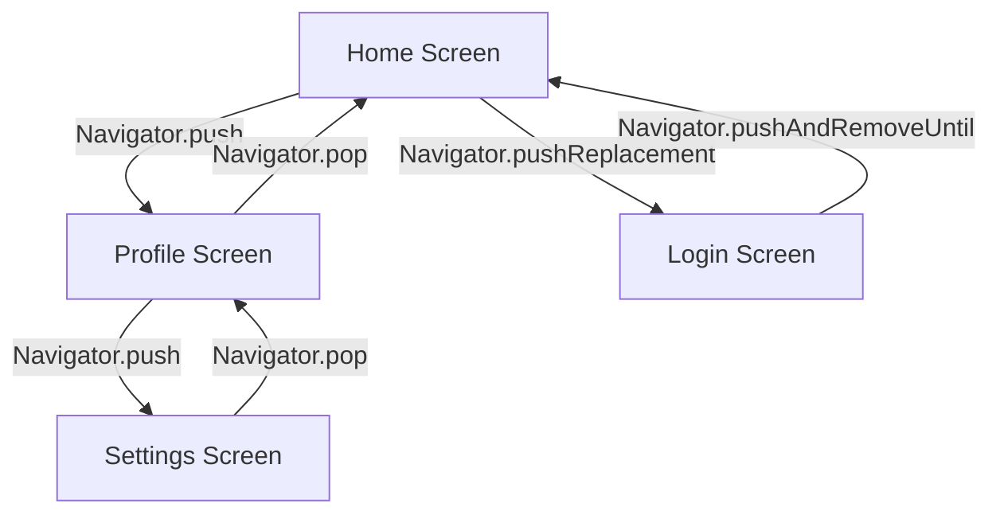
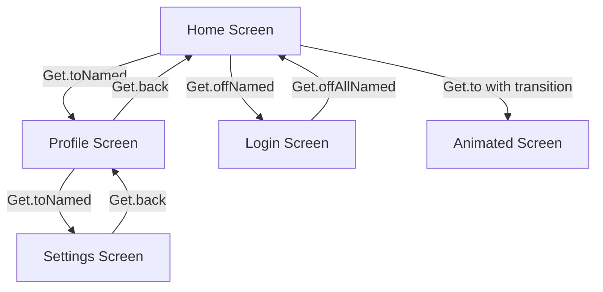
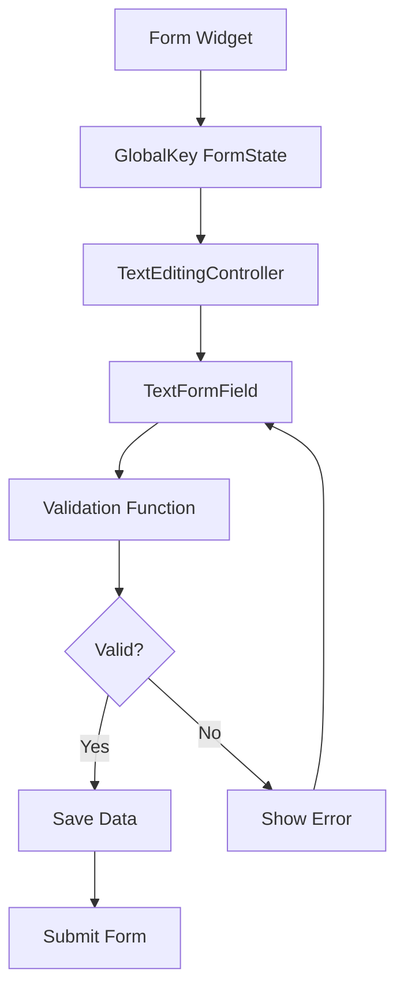
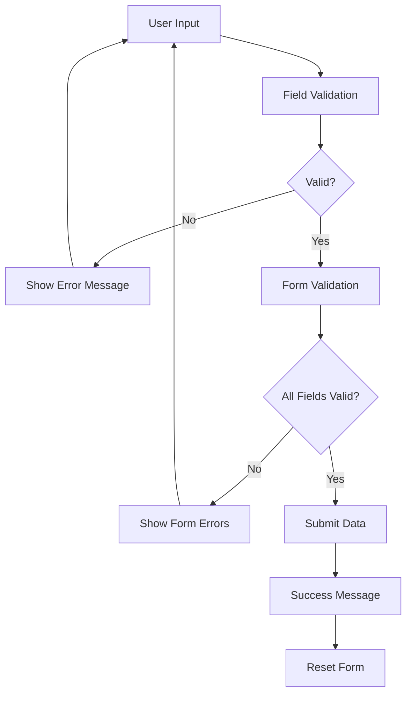

# 🧭 Flutter Navigation & Forms with Validation - Complete Guide

<div align="center">


**Navigate Like a Pro, Validate Like a Boss! 🚀**

*Master Flutter navigation and create bulletproof forms! ✨*

</div>

---

## 🎯 What You'll Learn in This Branch

This branch covers everything about navigation and forms in Flutter:

- 🧭 **Flutter Navigator**: Built-in navigation system
- 📱 **GetX Navigation**: Advanced state management navigation
- 📝 **Form Structure**: Keys, controllers, and widgets
- 🎛️ **Input Widgets**: Text fields, dropdowns, pickers, and more
- ✅ **Validation**: Centralized validation with custom classes
- 🎨 **UI Guidelines**: Best practices for form design

---

## 📚 Lecture Notes

### 1. Flutter Navigator - The Foundation 🧭

Flutter's Navigator manages a stack of routes and provides methods to navigate between them. Think of it as a stack of screens where you can push, pop, and replace screens.

#### Basic Navigation Concepts

```dart
// Navigation Stack Visualization
// Screen 1 (Home) <- Screen 2 (Profile) <- Screen 3 (Settings)
//                    ↑ Current Screen (Top of Stack)
```

#### Essential Navigation Methods

**Navigator.push()** - Add a new screen to the stack:
```dart
// Navigate to a new screen
Navigator.push(
  context,
  MaterialPageRoute(
    builder: (context) => ProfileScreen(),
  ),
);

```

**Navigator.pop()** - Remove current screen from stack:
```dart
// Go back to previous screen
Navigator.pop(context);

// Return data to previous screen
Navigator.pop(context, 'User data saved!');

// Check if we can pop
if (Navigator.canPop(context)) {
  Navigator.pop(context);
}
```

**Navigator.pushReplacement()** - Replace current screen:
```dart
// Replace current screen (useful for login -> home)
Navigator.pushReplacement(
  context,
  MaterialPageRoute(builder: (context) => HomeScreen()),
);
```

**Navigator.pushAndRemoveUntil()** - Clear stack and navigate:
```dart
// Clear entire stack and navigate to home (useful for logout)
Navigator.pushAndRemoveUntil(
  context,
  MaterialPageRoute(builder: (context) => HomeScreen()),
  (route) => false, // Remove all previous routes
);
```

#### Named Routes - Professional Approach

**Setting up named routes:**
```dart
MaterialApp(
  initialRoute: '/',
  routes: {
    '/': (context) => HomeScreen(),
    '/profile': (context) => ProfileScreen(),
    '/settings': (context) => SettingsScreen(),
    '/login': (context) => LoginScreen(),
  },
  onGenerateRoute: (settings) {
    // Handle dynamic routes
    if (settings.name == '/user') {
      final args = settings.arguments as Map<String, dynamic>;
      return MaterialPageRoute(
        builder: (context) => UserScreen(userId: args['userId']),
      );
    }
    return null;
  },
)
```

**Using named routes:**
```dart
// Navigate using named routes
Navigator.pushNamed(context, '/profile');

// With arguments
Navigator.pushNamed(
  context,
  '/user',
  arguments: {'userId': 123, 'name': 'John'},
);

// Replace with named route
Navigator.pushReplacementNamed(context, '/home');
```

#### Navigation Flow Diagram



#### Advanced Navigation Patterns

**Modal Bottom Sheet:**
```dart
showModalBottomSheet(
  context: context,
  builder: (context) => Container(
    height: 300,
    child: Column(
      children: [
        Text('Modal Content'),
        ElevatedButton(
          onPressed: () => Navigator.pop(context),
          child: Text('Close'),
        ),
      ],
    ),
  ),
);
```

**Custom Dialog:**
```dart
showDialog(
  context: context,
  builder: (context) => AlertDialog(
    title: Text('Confirm'),
    content: Text('Are you sure?'),
    actions: [
      TextButton(
        onPressed: () => Navigator.pop(context),
        child: Text('Cancel'),
      ),
      ElevatedButton(
        onPressed: () {
          // Perform action
          Navigator.pop(context);
        },
        child: Text('Confirm'),
      ),
    ],
  ),
);
```

### 2. GetX Navigation - Advanced State Management 📱

GetX provides a more powerful navigation system with state management integration.

#### Setting up GetX Navigation

**Add dependency to pubspec.yaml:**
```yaml
dependencies:
  get: ^4.6.6
```

**Configure GetX in main.dart:**
```dart
import 'package:get/get.dart';

void main() {
  runApp(MyApp());
}

class MyApp extends StatelessWidget {
  @override
  Widget build(BuildContext context) {
    return GetMaterialApp( // Use GetMaterialApp instead of MaterialApp
      title: 'Flutter Demo',
      initialRoute: '/',
      getPages: [
        GetPage(name: '/', page: () => HomeScreen()),
        GetPage(name: '/profile', page: () => ProfileScreen()),
        GetPage(name: '/settings', page: () => SettingsScreen()),
        GetPage(
          name: '/user/:id', // Dynamic route with parameter
          page: () => UserScreen(),
        ),
      ],
    );
  }
}
```

#### GetX Navigation Methods

**Basic Navigation:**
```dart
// Navigate to named route
Get.toNamed('/profile');

// Navigate with arguments
Get.toNamed('/profile', arguments: {'name': 'John', 'age': 25});

// Navigate and replace
Get.offNamed('/home');

// Navigate and clear stack
Get.offAllNamed('/login');

// Go back
Get.back();

// Go back with result
Get.back(result: 'Data from screen');
```

**Advanced GetX Navigation:**
```dart
// Navigate with transition
Get.to(
  () => ProfileScreen(),
  transition: Transition.fadeIn,
  duration: Duration(milliseconds: 300),
);

// Navigate with custom transition
Get.to(
  () => ProfileScreen(),
  transition: Transition.cupertino,
  curve: Curves.easeInOut,
);

// Navigate with binding (for dependency injection)
Get.to(() => ProfileScreen(), binding: ProfileBinding());
```

#### GetX Route Parameters

**Accessing route parameters:**
```dart
class UserScreen extends StatelessWidget {
  @override
  Widget build(BuildContext context) {
    // Get route parameters
    final userId = Get.parameters['id'];
    final arguments = Get.arguments;
    
    return Scaffold(
      appBar: AppBar(title: Text('User $userId')),
      body: Text('Arguments: $arguments'),
    );
  }
}
```

#### GetX Navigation Flow Diagram



### 3. Form Structure - The Foundation 📝

Forms in Flutter are built using several key components that work together to create a cohesive data collection experience.

#### Core Form Components

**Form Widget** - The container that manages form state:
```dart
class MyForm extends StatefulWidget {
  @override
  _MyFormState createState() => _MyFormState();
}

class _MyFormState extends State<MyForm> {
  final _formKey = GlobalKey<FormState>();
  
  @override
  Widget build(BuildContext context) {
    return Form(
      key: _formKey,
      child: Column(
        children: [
          // Form fields go here
        ],
      ),
    );
  }
}
```

**GlobalKey<FormState>** - Controls form validation and state:
```dart
final _formKey = GlobalKey<FormState>();

// Validate entire form
if (_formKey.currentState!.validate()) {
  // Form is valid, proceed with submission
  _formKey.currentState!.save();
}

// Reset form
_formKey.currentState!.reset();
```

**TextEditingController** - Manages text input state:
```dart
class _MyFormState extends State<MyForm> {
  final _nameController = TextEditingController();
  final _emailController = TextEditingController();
  final _phoneController = TextEditingController();
  
  @override
  void dispose() {
    // Always dispose controllers to prevent memory leaks
    _nameController.dispose();
    _emailController.dispose();
    _phoneController.dispose();
    super.dispose();
  }
  
  @override
  Widget build(BuildContext context) {
    return Form(
      key: _formKey,
      child: Column(
        children: [
          TextFormField(
            controller: _nameController,
            decoration: InputDecoration(labelText: 'Name'),
            validator: (value) {
              if (value == null || value.isEmpty) {
                return 'Please enter your name';
              }
              return null;
            },
          ),
          // More fields...
        ],
      ),
    );
  }
}
```

#### Form State Management Flow



### 4. Input Widgets - The Building Blocks 🎛️

Flutter provides a rich set of input widgets for different data types and user interactions.

#### Text Input Variations

**Basic TextFormField:**
```dart
TextFormField(
  controller: _controller,
  decoration: InputDecoration(
    labelText: 'Enter text',
    hintText: 'Type something...',
    prefixIcon: Icon(Icons.text_fields),
    suffixIcon: IconButton(
      icon: Icon(Icons.clear),
      onPressed: () => _controller.clear(),
    ),
    border: OutlineInputBorder(
      borderRadius: BorderRadius.circular(8),
    ),
  ),
  validator: (value) => value?.isEmpty == true ? 'Required field' : null,
)
```

**Multiline TextField:**
```dart
TextFormField(
  controller: _descriptionController,
  maxLines: 5,
  decoration: InputDecoration(
    labelText: 'Description',
    hintText: 'Enter detailed description...',
    alignLabelWithHint: true,
    border: OutlineInputBorder(),
  ),
  validator: (value) {
    if (value == null || value.isEmpty) {
      return 'Description is required';
    }
    if (value.length < 10) {
      return 'Description must be at least 10 characters';
    }
    return null;
  },
)
```

**Password Field:**
```dart
class PasswordField extends StatefulWidget {
  final TextEditingController controller;
  final String? Function(String?)? validator;
  
  const PasswordField({
    Key? key,
    required this.controller,
    this.validator,
  }) : super(key: key);
  
  @override
  _PasswordFieldState createState() => _PasswordFieldState();
}

class _PasswordFieldState extends State<PasswordField> {
  bool _obscureText = true;
  
  @override
  Widget build(BuildContext context) {
    return TextFormField(
      controller: widget.controller,
      obscureText: _obscureText,
      decoration: InputDecoration(
        labelText: 'Password',
        prefixIcon: Icon(Icons.lock),
        suffixIcon: IconButton(
          icon: Icon(_obscureText ? Icons.visibility : Icons.visibility_off),
          onPressed: () {
            setState(() {
              _obscureText = !_obscureText;
            });
          },
        ),
        border: OutlineInputBorder(),
      ),
      validator: widget.validator,
    );
  }
}
```

#### Dropdown Widgets

**DropdownButtonFormField:**
```dart
class CountryDropdown extends StatefulWidget {
  @override
  _CountryDropdownState createState() => _CountryDropdownState();
}

class _CountryDropdownState extends State<CountryDropdown> {
  String? _selectedCountry;
  final List<String> _countries = [
    'Bangladesh',
    'India',
    'Pakistan',
    'Sri Lanka',
    'Nepal',
  ];
  
  @override
  Widget build(BuildContext context) {
    return DropdownButtonFormField<String>(
      value: _selectedCountry,
      decoration: InputDecoration(
        labelText: 'Select Country',
        border: OutlineInputBorder(),
      ),
      items: _countries.map((String country) {
        return DropdownMenuItem<String>(
          value: country,
          child: Text(country),
        );
      }).toList(),
      onChanged: (String? newValue) {
        setState(() {
          _selectedCountry = newValue;
        });
      },
      validator: (value) => value == null ? 'Please select a country' : null,
    );
  }
}
```

**Custom Dropdown with Search:**
```dart
class SearchableDropdown extends StatefulWidget {
  @override
  _SearchableDropdownState createState() => _SearchableDropdownState();
}

class _SearchableDropdownState extends State<SearchableDropdown> {
  String? _selectedCity;
  final List<String> _cities = [
    'Dhaka', 'Chittagong', 'Sylhet', 'Rajshahi', 'Khulna',
    'Barisal', 'Rangpur', 'Mymensingh', 'Cox\'s Bazar', 'Comilla'
  ];
  List<String> _filteredCities = [];
  final TextEditingController _searchController = TextEditingController();
  
  @override
  void initState() {
    super.initState();
    _filteredCities = _cities;
  }
  
  @override
  Widget build(BuildContext context) {
    return Column(
      children: [
        TextFormField(
          controller: _searchController,
          decoration: InputDecoration(
            labelText: 'Search City',
            prefixIcon: Icon(Icons.search),
            border: OutlineInputBorder(),
          ),
          onChanged: (value) {
            setState(() {
              _filteredCities = _cities
                  .where((city) => city.toLowerCase().contains(value.toLowerCase()))
                  .toList();
            });
          },
        ),
        SizedBox(height: 8),
        DropdownButtonFormField<String>(
          value: _selectedCity,
          decoration: InputDecoration(
            labelText: 'Select City',
            border: OutlineInputBorder(),
          ),
          items: _filteredCities.map((String city) {
            return DropdownMenuItem<String>(
              value: city,
              child: Text(city),
            );
          }).toList(),
          onChanged: (String? newValue) {
            setState(() {
              _selectedCity = newValue;
            });
          },
          validator: (value) => value == null ? 'Please select a city' : null,
        ),
      ],
    );
  }
}
```

#### Date and Time Pickers

**Date Picker:**
```dart
class DatePickerField extends StatefulWidget {
  @override
  _DatePickerFieldState createState() => _DatePickerFieldState();
}

class _DatePickerFieldState extends State<DatePickerField> {
  DateTime? _selectedDate;
  final TextEditingController _dateController = TextEditingController();
  
  Future<void> _selectDate(BuildContext context) async {
    final DateTime? picked = await showDatePicker(
      context: context,
      initialDate: _selectedDate ?? DateTime.now(),
      firstDate: DateTime(1900),
      lastDate: DateTime.now(),
    );
    
    if (picked != null && picked != _selectedDate) {
      setState(() {
        _selectedDate = picked;
        _dateController.text = DateFormat('dd/MM/yyyy').format(picked);
      });
    }
  }
  
  @override
  Widget build(BuildContext context) {
    return TextFormField(
      controller: _dateController,
      decoration: InputDecoration(
        labelText: 'Select Date',
        prefixIcon: Icon(Icons.calendar_today),
        border: OutlineInputBorder(),
      ),
      readOnly: true,
      onTap: () => _selectDate(context),
      validator: (value) => value == null || value.isEmpty ? 'Please select a date' : null,
    );
  }
}
```

**Time Picker:**
```dart
class TimePickerField extends StatefulWidget {
  @override
  _TimePickerFieldState createState() => _TimePickerFieldState();
}

class _TimePickerFieldState extends State<TimePickerField> {
  TimeOfDay? _selectedTime;
  final TextEditingController _timeController = TextEditingController();
  
  Future<void> _selectTime(BuildContext context) async {
    final TimeOfDay? picked = await showTimePicker(
      context: context,
      initialTime: _selectedTime ?? TimeOfDay.now(),
    );
    
    if (picked != null && picked != _selectedTime) {
      setState(() {
        _selectedTime = picked;
        _timeController.text = picked.format(context);
      });
    }
  }
  
  @override
  Widget build(BuildContext context) {
    return TextFormField(
      controller: _timeController,
      decoration: InputDecoration(
        labelText: 'Select Time',
        prefixIcon: Icon(Icons.access_time),
        border: OutlineInputBorder(),
      ),
      readOnly: true,
      onTap: () => _selectTime(context),
      validator: (value) => value == null || value.isEmpty ? 'Please select a time' : null,
    );
  }
}
```

#### Radio Buttons and Checkboxes

**Radio Button Group:**
```dart
class GenderRadioGroup extends StatefulWidget {
  @override
  _GenderRadioGroupState createState() => _GenderRadioGroupState();
}

class _GenderRadioGroupState extends State<GenderRadioGroup> {
  String? _selectedGender;
  
  @override
  Widget build(BuildContext context) {
    return Column(
      crossAxisAlignment: CrossAxisAlignment.start,
      children: [
        Text('Gender', style: TextStyle(fontSize: 16, fontWeight: FontWeight.w500)),
        RadioListTile<String>(
          title: Text('Male'),
          value: 'male',
          groupValue: _selectedGender,
          onChanged: (String? value) {
            setState(() {
              _selectedGender = value;
            });
          },
        ),
        RadioListTile<String>(
          title: Text('Female'),
          value: 'female',
          groupValue: _selectedGender,
          onChanged: (String? value) {
            setState(() {
              _selectedGender = value;
            });
          },
        ),
        RadioListTile<String>(
          title: Text('Other'),
          value: 'other',
          groupValue: _selectedGender,
          onChanged: (String? value) {
            setState(() {
              _selectedGender = value;
            });
          },
        ),
        if (_selectedGender == null)
          Padding(
            padding: EdgeInsets.only(left: 16),
            child: Text('Please select a gender', style: TextStyle(color: Colors.red)),
          ),
      ],
    );
  }
}
```

**Checkbox Group:**
```dart
class InterestCheckboxGroup extends StatefulWidget {
  @override
  _InterestCheckboxGroupState createState() => _InterestCheckboxGroupState();
}

class _InterestCheckboxGroupState extends State<InterestCheckboxGroup> {
  final Map<String, bool> _interests = {
    'Technology': false,
    'Sports': false,
    'Music': false,
    'Travel': false,
    'Reading': false,
    'Cooking': false,
  };
  
  @override
  Widget build(BuildContext context) {
    return Column(
      crossAxisAlignment: CrossAxisAlignment.start,
      children: [
        Text('Interests', style: TextStyle(fontSize: 16, fontWeight: FontWeight.w500)),
        ..._interests.keys.map((String interest) {
          return CheckboxListTile(
            title: Text(interest),
            value: _interests[interest],
            onChanged: (bool? value) {
              setState(() {
                _interests[interest] = value ?? false;
              });
            },
          );
        }).toList(),
        if (!_interests.values.any((selected) => selected))
          Padding(
            padding: EdgeInsets.only(left: 16),
            child: Text('Please select at least one interest', style: TextStyle(color: Colors.red)),
          ),
      ],
    );
  }
}
```

### 5. UI Changes Related Guide 🎨

Creating beautiful and user-friendly forms requires attention to UI/UX principles.

#### Form Layout Best Practices

**Spacing and Alignment:**
```dart
Form(
  key: _formKey,
  child: Padding(
    padding: EdgeInsets.all(16.0),
    child: Column(
      crossAxisAlignment: CrossAxisAlignment.stretch,
      children: [
        SizedBox(height: 16),
        TextFormField(
          decoration: InputDecoration(
            labelText: 'Name',
            border: OutlineInputBorder(),
          ),
        ),
        SizedBox(height: 16), // Consistent spacing
        TextFormField(
          decoration: InputDecoration(
            labelText: 'Email',
            border: OutlineInputBorder(),
          ),
        ),
        SizedBox(height: 24), // Extra space before buttons
        ElevatedButton(
          onPressed: _submitForm,
          child: Text('Submit'),
        ),
      ],
    ),
  ),
)
```

**Responsive Form Design:**
```dart
class ResponsiveForm extends StatelessWidget {
  @override
  Widget build(BuildContext context) {
    return LayoutBuilder(
      builder: (context, constraints) {
        if (constraints.maxWidth > 600) {
          // Tablet/Desktop layout
          return Row(
            children: [
              Expanded(
                flex: 1,
                child: _buildFormColumn(),
              ),
              SizedBox(width: 24),
              Expanded(
                flex: 1,
                child: _buildFormColumn(),
              ),
            ],
          );
        } else {
          // Mobile layout
          return _buildFormColumn();
        }
      },
    );
  }
  
  Widget _buildFormColumn() {
    return Column(
      children: [
        TextFormField(decoration: InputDecoration(labelText: 'Field 1')),
        SizedBox(height: 16),
        TextFormField(decoration: InputDecoration(labelText: 'Field 2')),
      ],
    );
  }
}
```

**Form Validation UI States:**
```dart
class ValidatedTextField extends StatefulWidget {
  final String label;
  final String? Function(String?)? validator;
  final TextEditingController controller;
  
  const ValidatedTextField({
    Key? key,
    required this.label,
    required this.validator,
    required this.controller,
  }) : super(key: key);
  
  @override
  _ValidatedTextFieldState createState() => _ValidatedTextFieldState();
}

class _ValidatedTextFieldState extends State<ValidatedTextField> {
  String? _errorText;
  bool _isValid = false;
  
  void _validateField(String value) {
    setState(() {
      _errorText = widget.validator?.call(value);
      _isValid = _errorText == null && value.isNotEmpty;
    });
  }
  
  @override
  Widget build(BuildContext context) {
    return TextFormField(
      controller: widget.controller,
      decoration: InputDecoration(
        labelText: widget.label,
        border: OutlineInputBorder(),
        errorText: _errorText,
        suffixIcon: _isValid 
          ? Icon(Icons.check_circle, color: Colors.green)
          : null,
        focusedBorder: OutlineInputBorder(
          borderSide: BorderSide(
            color: _isValid ? Colors.green : Colors.blue,
            width: 2,
          ),
        ),
      ),
      onChanged: _validateField,
    );
  }
}
```

### 6. Validation - The Guardian Shield ✅

Validation ensures data integrity and provides user feedback. Let's create a comprehensive validation system.

#### Custom Validators Class

```dart
class Validators {
  // Email validation
  static String? emailValidation(String? email) {
    if (email == null || email.isEmpty) {
      return 'Email is required';
    }
    
    final emailRegex = RegExp(r'^[\w-\.]+@([\w-]+\.)+[\w-]{2,4}$');
    if (!emailRegex.hasMatch(email)) {
      return 'Please enter a valid email address';
    }
    
    return null;
  }
  
  // Bangladesh phone number validation
  static String? bangladeshNumberValidator(String? phone) {
    if (phone == null || phone.isEmpty) {
      return 'Phone number is required';
    }
    
    // Remove all non-digit characters
    String cleanPhone = phone.replaceAll(RegExp(r'[^\d]'), '');
    
    // Check if it starts with country code
    if (cleanPhone.startsWith('880')) {
      cleanPhone = cleanPhone.substring(3);
    } else if (cleanPhone.startsWith('0')) {
      cleanPhone = cleanPhone.substring(1);
    }
    
    // Bangladesh mobile numbers are 11 digits
    if (cleanPhone.length != 11) {
      return 'Phone number must be 11 digits';
    }
    
    // Check if it starts with valid prefixes
    List<String> validPrefixes = ['013', '014', '015', '016', '017', '018', '019'];
    String prefix = cleanPhone.substring(0, 3);
    
    if (!validPrefixes.contains(prefix)) {
      return 'Please enter a valid Bangladesh mobile number';
    }
    
    return null;
  }
  
  // Password validation
  static String? passwordValidator(String? password) {
    if (password == null || password.isEmpty) {
      return 'Password is required';
    }
    
    if (password.length < 8) {
      return 'Password must be at least 8 characters long';
    }
    
    if (!password.contains(RegExp(r'[A-Z]'))) {
      return 'Password must contain at least one uppercase letter';
    }
    
    if (!password.contains(RegExp(r'[a-z]'))) {
      return 'Password must contain at least one lowercase letter';
    }
    
    if (!password.contains(RegExp(r'[0-9]'))) {
      return 'Password must contain at least one number';
    }
    
    if (!password.contains(RegExp(r'[!@#$%^&*(),.?":{}|<>]'))) {
      return 'Password must contain at least one special character';
    }
    
    return null;
  }
  
  // Confirm password validation
  static String? confirmPasswordValidator(String? password, String? confirmPassword) {
    if (confirmPassword == null || confirmPassword.isEmpty) {
      return 'Please confirm your password';
    }
    
    if (password != confirmPassword) {
      return 'Passwords do not match';
    }
    
    return null;
  }
  
  // Name validation
  static String? nameValidator(String? name) {
    if (name == null || name.isEmpty) {
      return 'Name is required';
    }
    
    if (name.length < 2) {
      return 'Name must be at least 2 characters long';
    }
    
    if (!RegExp(r'^[a-zA-Z\s]+$').hasMatch(name)) {
      return 'Name can only contain letters and spaces';
    }
    
    return null;
  }
  
  // Age validation
  static String? ageValidator(String? age) {
    if (age == null || age.isEmpty) {
      return 'Age is required';
    }
    
    int? ageValue = int.tryParse(age);
    if (ageValue == null) {
      return 'Please enter a valid age';
    }
    
    if (ageValue < 13) {
      return 'You must be at least 13 years old';
    }
    
    if (ageValue > 120) {
      return 'Please enter a valid age';
    }
    
    return null;
  }
  
  // NID (National ID) validation for Bangladesh
  static String? nidValidator(String? nid) {
    if (nid == null || nid.isEmpty) {
      return 'NID is required';
    }
    
    // Remove all non-digit characters
    String cleanNid = nid.replaceAll(RegExp(r'[^\d]'), '');
    
    // Bangladesh NID is 10 or 13 digits
    if (cleanNid.length != 10 && cleanNid.length != 13) {
      return 'NID must be 10 or 13 digits';
    }
    
    return null;
  }
  
  // Required field validation
  static String? requiredValidator(String? value, String fieldName) {
    if (value == null || value.isEmpty) {
      return '$fieldName is required';
    }
    return null;
  }
  
  // Minimum length validation
  static String? minLengthValidator(String? value, int minLength, String fieldName) {
    if (value == null || value.isEmpty) {
      return '$fieldName is required';
    }
    
    if (value.length < minLength) {
      return '$fieldName must be at least $minLength characters long';
    }
    
    return null;
  }
  
  // Maximum length validation
  static String? maxLengthValidator(String? value, int maxLength, String fieldName) {
    if (value == null || value.isEmpty) {
      return '$fieldName is required';
    }
    
    if (value.length > maxLength) {
      return '$fieldName must not exceed $maxLength characters';
    }
    
    return null;
  }
  
  // URL validation
  static String? urlValidator(String? url) {
    if (url == null || url.isEmpty) {
      return 'URL is required';
    }
    
    final urlRegex = RegExp(
      r'^https?:\/\/(www\.)?[-a-zA-Z0-9@:%._\+~#=]{1,256}\.[a-zA-Z0-9()]{1,6}\b([-a-zA-Z0-9()@:%_\+.~#?&//=]*)$'
    );
    
    if (!urlRegex.hasMatch(url)) {
      return 'Please enter a valid URL';
    }
    
    return null;
  }
}
```

#### Form Validation Implementation

**Complete Form with Validation:**
```dart
class CompleteForm extends StatefulWidget {
  @override
  _CompleteFormState createState() => _CompleteFormState();
}

class _CompleteFormState extends State<CompleteForm> {
  final _formKey = GlobalKey<FormState>();
  final _nameController = TextEditingController();
  final _emailController = TextEditingController();
  final _phoneController = TextEditingController();
  final _passwordController = TextEditingController();
  final _confirmPasswordController = TextEditingController();
  final _ageController = TextEditingController();
  final _nidController = TextEditingController();
  
  String? _selectedCountry;
  String? _selectedGender;
  DateTime? _selectedDate;
  final Map<String, bool> _interests = {
    'Technology': false,
    'Sports': false,
    'Music': false,
    'Travel': false,
  };
  
  @override
  void dispose() {
    _nameController.dispose();
    _emailController.dispose();
    _phoneController.dispose();
    _passwordController.dispose();
    _confirmPasswordController.dispose();
    _ageController.dispose();
    _nidController.dispose();
    super.dispose();
  }
  
  void _submitForm() {
    if (_formKey.currentState!.validate()) {
      // Check additional validations
      if (_selectedCountry == null) {
        ScaffoldMessenger.of(context).showSnackBar(
          SnackBar(content: Text('Please select a country')),
        );
        return;
      }
      
      if (_selectedGender == null) {
        ScaffoldMessenger.of(context).showSnackBar(
          SnackBar(content: Text('Please select a gender')),
        );
        return;
      }
      
      if (!_interests.values.any((selected) => selected)) {
        ScaffoldMessenger.of(context).showSnackBar(
          SnackBar(content: Text('Please select at least one interest')),
        );
        return;
      }
      
      // Form is valid, proceed with submission
      _formKey.currentState!.save();
      
      // Show success message
      ScaffoldMessenger.of(context).showSnackBar(
        SnackBar(content: Text('Form submitted successfully!')),
      );
      
      // Reset form
      _resetForm();
    }
  }
  
  void _resetForm() {
    _formKey.currentState!.reset();
    _nameController.clear();
    _emailController.clear();
    _phoneController.clear();
    _passwordController.clear();
    _confirmPasswordController.clear();
    _ageController.clear();
    _nidController.clear();
    setState(() {
      _selectedCountry = null;
      _selectedGender = null;
      _selectedDate = null;
      _interests.updateAll((key, value) => false);
    });
  }
  
  @override
  Widget build(BuildContext context) {
    return Scaffold(
      appBar: AppBar(title: Text('Complete Form')),
      body: SingleChildScrollView(
        padding: EdgeInsets.all(16),
        child: Form(
          key: _formKey,
          child: Column(
            crossAxisAlignment: CrossAxisAlignment.stretch,
            children: [
              // Personal Information Section
              Text('Personal Information', 
                   style: Theme.of(context).textTheme.headlineSmall),
              SizedBox(height: 16),
              
              TextFormField(
                controller: _nameController,
                decoration: InputDecoration(
                  labelText: 'Full Name',
                  border: OutlineInputBorder(),
                ),
                validator: Validators.nameValidator,
              ),
              SizedBox(height: 16),
              
              TextFormField(
                controller: _emailController,
                decoration: InputDecoration(
                  labelText: 'Email',
                  border: OutlineInputBorder(),
                ),
                keyboardType: TextInputType.emailAddress,
                validator: Validators.emailValidation,
              ),
              SizedBox(height: 16),
              
              TextFormField(
                controller: _phoneController,
                decoration: InputDecoration(
                  labelText: 'Phone Number',
                  border: OutlineInputBorder(),
                ),
                keyboardType: TextInputType.phone,
                validator: Validators.bangladeshNumberValidator,
              ),
              SizedBox(height: 16),
              
              TextFormField(
                controller: _ageController,
                decoration: InputDecoration(
                  labelText: 'Age',
                  border: OutlineInputBorder(),
                ),
                keyboardType: TextInputType.number,
                validator: Validators.ageValidator,
              ),
              SizedBox(height: 16),
              
              TextFormField(
                controller: _nidController,
                decoration: InputDecoration(
                  labelText: 'NID Number',
                  border: OutlineInputBorder(),
                ),
                keyboardType: TextInputType.number,
                validator: Validators.nidValidator,
              ),
              SizedBox(height: 24),
              
              // Security Section
              Text('Security', 
                   style: Theme.of(context).textTheme.headlineSmall),
              SizedBox(height: 16),
              
              TextFormField(
                controller: _passwordController,
                decoration: InputDecoration(
                  labelText: 'Password',
                  border: OutlineInputBorder(),
                ),
                obscureText: true,
                validator: Validators.passwordValidator,
              ),
              SizedBox(height: 16),
              
              TextFormField(
                controller: _confirmPasswordController,
                decoration: InputDecoration(
                  labelText: 'Confirm Password',
                  border: OutlineInputBorder(),
                ),
                obscureText: true,
                validator: (value) => Validators.confirmPasswordValidator(
                  _passwordController.text, value),
              ),
              SizedBox(height: 24),
              
              // Additional Information Section
              Text('Additional Information', 
                   style: Theme.of(context).textTheme.headlineSmall),
              SizedBox(height: 16),
              
              // Country Dropdown
              DropdownButtonFormField<String>(
                value: _selectedCountry,
                decoration: InputDecoration(
                  labelText: 'Country',
                  border: OutlineInputBorder(),
                ),
                items: ['Bangladesh', 'India', 'Pakistan', 'Sri Lanka']
                    .map((String country) {
                  return DropdownMenuItem<String>(
                    value: country,
                    child: Text(country),
                  );
                }).toList(),
                onChanged: (String? newValue) {
                  setState(() {
                    _selectedCountry = newValue;
                  });
                },
                validator: (value) => Validators.requiredValidator(value, 'Country'),
              ),
              SizedBox(height: 16),
              
              // Gender Radio Group
              Text('Gender', style: TextStyle(fontSize: 16, fontWeight: FontWeight.w500)),
              RadioListTile<String>(
                title: Text('Male'),
                value: 'male',
                groupValue: _selectedGender,
                onChanged: (String? value) {
                  setState(() {
                    _selectedGender = value;
                  });
                },
              ),
              RadioListTile<String>(
                title: Text('Female'),
                value: 'female',
                groupValue: _selectedGender,
                onChanged: (String? value) {
                  setState(() {
                    _selectedGender = value;
                  });
                },
              ),
              SizedBox(height: 16),
              
              // Interests Checkbox Group
              Text('Interests', style: TextStyle(fontSize: 16, fontWeight: FontWeight.w500)),
              ..._interests.keys.map((String interest) {
                return CheckboxListTile(
                  title: Text(interest),
                  value: _interests[interest],
                  onChanged: (bool? value) {
                    setState(() {
                      _interests[interest] = value ?? false;
                    });
                  },
                );
              }).toList(),
              SizedBox(height: 24),
              
              // Submit Button
              ElevatedButton(
                onPressed: _submitForm,
                child: Text('Submit Form'),
              ),
              SizedBox(height: 16),
              
              // Reset Button
              OutlinedButton(
                onPressed: _resetForm,
                child: Text('Reset Form'),
              ),
            ],
          ),
        ),
      ),
    );
  }
}
```

#### Validation Flow Diagram



---

## 💻 Hands-On Projects

### Project 1: User Registration Form 📝
**Difficulty**: ⭐⭐⭐  
**Time**: 2 hours

Create a comprehensive user registration form with all validation features.

**Requirements**:
- Personal information fields (name, email, phone, age, NID)
- Password fields with strength validation
- Country dropdown with search
- Gender radio buttons
- Interests checkboxes
- Date picker for birth date
- Complete validation using custom Validators class
- Beautiful UI with proper spacing and error states

### Project 2: Multi-Step Form Wizard 🧙‍♂️
**Difficulty**: ⭐⭐⭐⭐  
**Time**: 3 hours

Build a multi-step form wizard with navigation between steps.

**Requirements**:
- Step 1: Personal Information
- Step 2: Contact Details
- Step 3: Preferences & Settings
- Step 4: Review & Submit
- Navigation between steps with validation
- Progress indicator
- Save draft functionality
- Back/Next buttons with proper validation

### Project 3: Dynamic Form Builder 🔧
**Difficulty**: ⭐⭐⭐⭐⭐  
**Time**: 4 hours

Create a dynamic form builder that can generate forms based on configuration.

**Requirements**:
- JSON configuration for form fields
- Dynamic field generation based on type
- Conditional field visibility
- Custom validation rules
- Form submission with structured data
- Export form configuration

---

## 🎯 Key Takeaways

After completing this branch, you should master:

1. **Flutter Navigator**: Built-in navigation system with routes and transitions
2. **GetX Navigation**: Advanced navigation with state management
3. **Form Structure**: Keys, controllers, and proper state management
4. **Input Widgets**: All types of form inputs with proper styling
5. **Validation System**: Centralized validation with custom validators
6. **UI/UX Best Practices**: Beautiful, responsive form design
7. **Error Handling**: Proper error states and user feedback

---

## 🔗 Additional Resources

- [Flutter Navigation Documentation](https://docs.flutter.dev/development/ui/navigation)
- [GetX Package Documentation](https://pub.dev/packages/get)
- [Material Design Guidelines](https://material.io/design)
- [Form Validation Best Practices](https://docs.flutter.dev/cookbook/forms/validation)

---

<div align="center">

**Navigate & Validate Like a Pro! 🚀**

*Great forms are the foundation of great user experiences!*

</div>